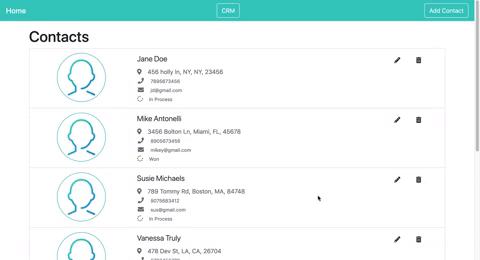
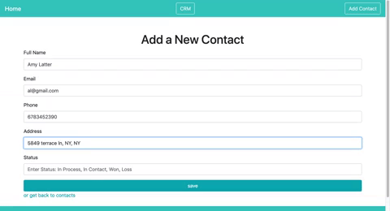
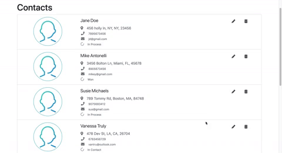
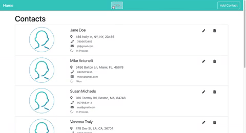

# Contact Management Application

<h1 align="center">
  <br>
  
</h1>

<h4 align="center">A Contact Management Application with CRM Implementation</h4>

Exhibiting a full-stack interactive Contact Managment small web application :computer: ! It features a functional CRM tab that will enable an organized process of storing information :raised_hands:. The CRM enhances the organization of contacts. It enables you to implement CRUD for all contacts in your created database 📇. The implementation was created efficiently using JavaScript, JSON, Fetch, AJAX requests, React Router, and Context. Its CRM feature is targeted at users needing a system capable of tracking sales, marketing, or even customer service 📈. While also custom-made for implementation in companies that need client information accessible and modifiable.

## Check it out!
👉 https://contact-management-application.vercel.app/

## Demo

### Contact List


<br>
### Add Contact


<br>
### Edit


<br>
### CRM


<br>
## Steps to install this project

##### 1. Clone the repository
```
$ git clone https://github.com/breatheco-de/exercise-contact-list-context.git
```
##### 2. Install the /node_modules
```
$ npm install
```
##### 3. Run the webpack development server
```
$ npm run start
```
- Check out the backend here 👉 https://github.com/NizaV/Contact-List-Backend

## Features

- [x] CRUD
- [x] CRM
- [x] Set status for tracking clients
- [ ] Login (soon!)
